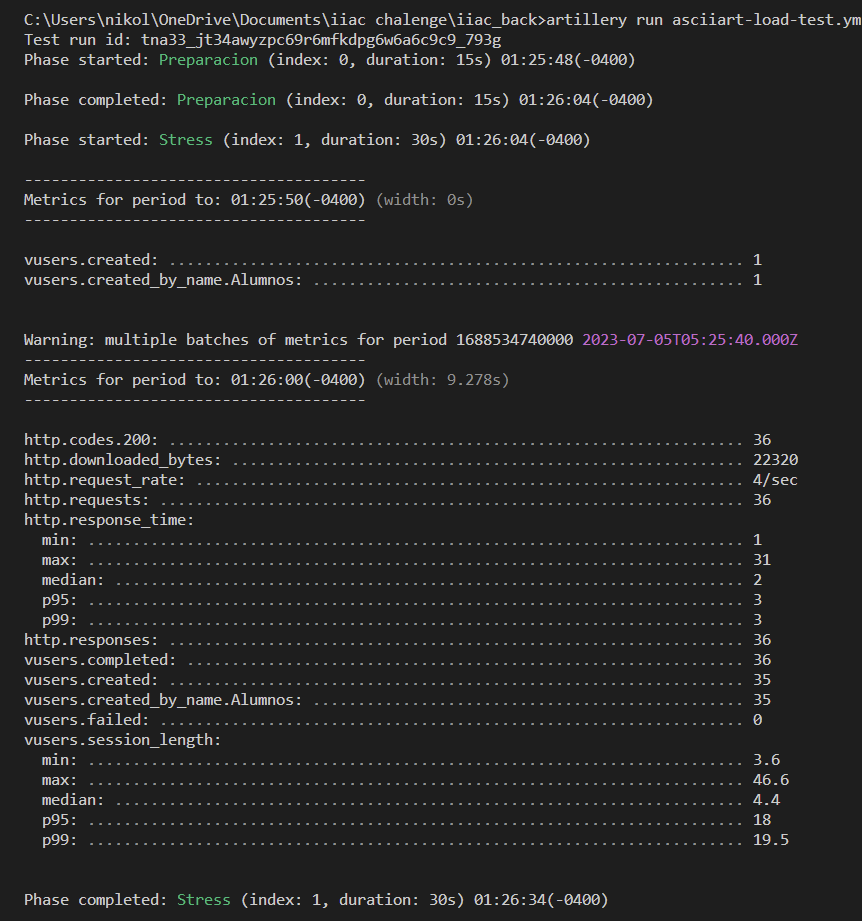
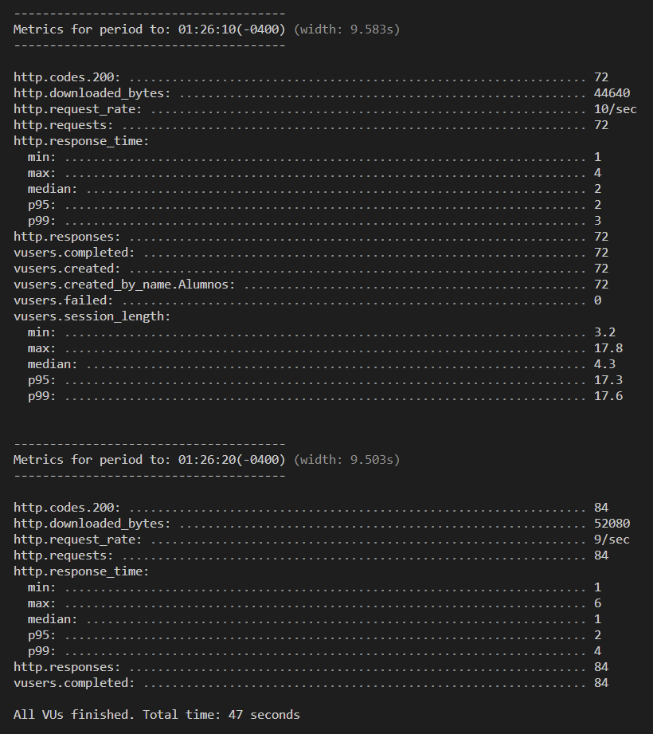
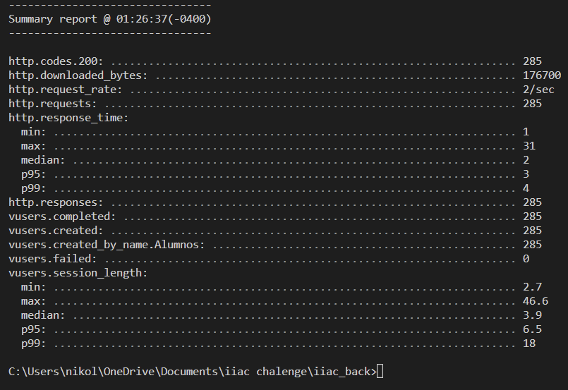

# IACC Challenge Back-end

## Instalación

Clonar repositorio: `https://github.com/NikolayCarrasco/iacc_back.git`

Instalar dependecias: `npm i`

Ejecutar aplicación: `npm run start:dev`

Alojamiento: `http://localhost:4000/`

## Pruebas de estrés

Ejecutar comando: `artillery run asciiart-load-test.yml`

## Comandos CURL

### Cursos

crear curso: `curl -X POST http://localhost:{PORT}/cursos -H "Content-Type: application/json" -d "{\"nombre\": \"Fundamentos Fisica\",\"codigo\": \"FIS-1234\",\"anyo\": \"2022\",\"semestre\": \"2\",\"sede\": \"Biblioteca 2\"}"`

agregar alumnos a curso: `curl -X POST http://localhost:{PORT}/cursos/:id/alumnos -H "Content-Type: application/json" -d "{\"alumnos\": [2,4,5]}"`

traer un curso: `curl -X GET http://localhost:{PORT}/cursos/:id -H "Content-Type: application/json"`

traer todos los cursos: `curl -X GET http://localhost:{PORT}/cursos -H "Content-Type: application/json"`

modificar datos del curso: `curl -X PATCH http://localhost:{PORT}/cursos/:id -H "Content-Type: application/json" -d "{\"nombre\": \"Fundamentos Quimica\",\"codigo\": \"QUI-2354\",\"anyo\": \"2013\",\"semestre\": \"1\",\"sede\": \"Laboratorio 1\"}"`

eliminar curso: `curl -X DELETE http://localhost:{PORT}/cursos/:id -H "Content-Type: application/json"`

### Alumnos

crear alumno: `curl -X POST http://localhost:{PORT}/alumnos -H "Content-Type: application/json" -d "{\"nombre\": \"Camila\",\"apellido\": \"Gonzalez\",\"email\": \"camila.c@mail.com\",\"edad\": 45,\"direccion\": \"Los naranjos 324 bloque C\"}"`

traer un alumno: `curl -X GET http://localhost:{PORT}/alumnos/:id -H "Content-Type: application/json"`

traer todos los alumnos: `curl -X GET http://localhost:{PORT}/alumnos -H "Content-Type: application/json"`

modificar datos del alumno: `curl -X PATCH http://localhost:{PORT}/alumnos/:id -H "Content-Type: application/json" -d "{\"nombre\": \"Juan\",\"apellido\": \"Perez\",\"email\": \"juan.p@mail.com\",\"edad\": 22,\"direccion\": \"Av. luceros 313\"}"`

eliminar alumno: `curl -X DELETE http://localhost:{PORT}/alumnos/:id -H "Content-Type: application/json"`
